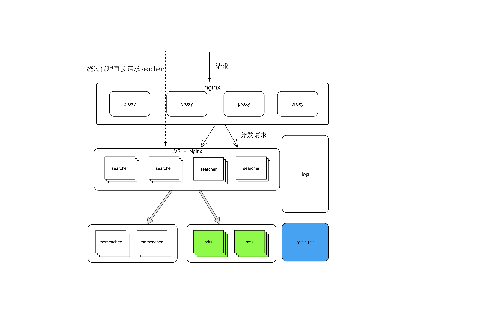

## 查询引擎
*Written by Go Language*  

### Step  
#### 1.fetch InvertedIndex Meta 
#### 2.fetch DocIdList
#### 3.filter docIdlist
#### 4.get DocGzMeta
#### 5.get DocGz  

### Architecture For Searcher & Proxy

